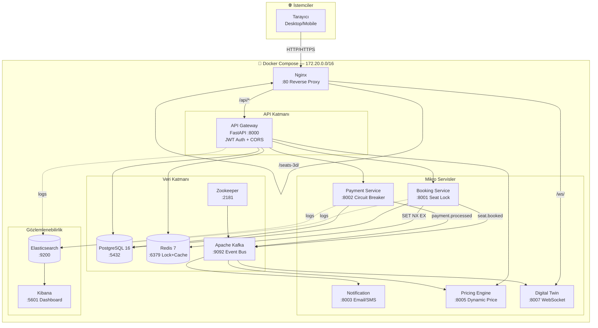
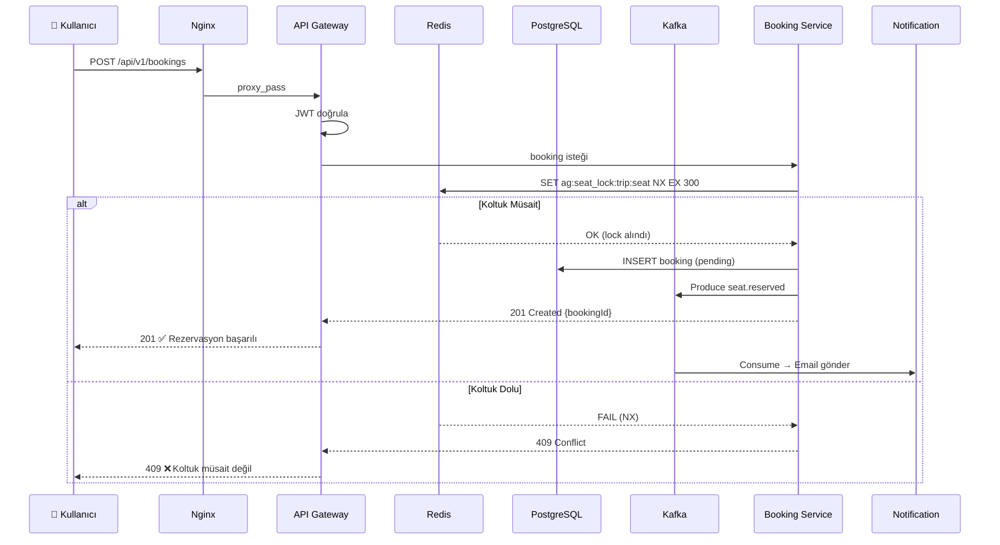

<div align="center">

# ⚡ BiletBudur — Next-Gen Biletleme Platformu

**"Yerçekimine meydan oku. Biletini uçur."**


**Sinematik 3D koltuk seçimi · Event-Driven mikro-servis mimarisi · ELK Stack loglama**

</div>

---

## 🌐 Ağ Erişimi — Telefon / Tablet

```
Sunucu IP:  10.159.109.35
```

| Servis | URL |
|--------|-----|
| 🖥 Frontend | http://10.159.109.35 |
| 🚌 3D Koltuk | http://10.159.109.35/seats-3d/ |
| ⚡ API Docs | http://10.159.109.35:8000/api/docs |
| 📊 Kibana | http://10.159.109.35:5601 |
| 🔍 Elasticsearch | http://10.159.109.35:9200 |

> **Telefonda Açmak İçin:** Aynı Wi-Fi ağında olduğunuzdan emin olun, tarayıcıya `http://10.159.109.35` yazın.

---

## 🚀 Hızlı Başlangıç

```bash
# 1 — Repoyu klonla
git clone <repo-url>
cd obilet2

# 2 — Altyapıyı başlat (tüm 12 servis)
cd infra
docker compose up -d --build

# 3 — Durum kontrol
docker compose ps

# 4 — React dev server (ağa aç)
cd ../frontend/seats-react
npm run dev -- --host 0.0.0.0
# → http://10.159.109.35:5174

# 5 — Logları izle
docker compose logs -f api-gateway booking-service kafka
```

**Demo Giriş:**
```
E-posta : dev@antigravity.app
Şifre   : 123456
```

---

## 🏗 Sistem Mimarisi



---

## 🔄 Rezervasyon Akışı



---

## ⚡ Race Condition Çözümü

```
Kullanıcı A → koltuk 15'i seçiyor  ┐
Kullanıcı B → koltuk 15'i seçiyor  ┘ (aynı anda)

Redis: SET ag:seat_lock:trip123:15 userA NX EX 300
       → SUCCESS ✅  (userA kilitledi — 5 dk)

Redis: SET ag:seat_lock:trip123:15 userB NX EX 300
       → FAIL ❌ (NX: sadece set et, eğer yoksa)
       → userB'ye: "Koltuk müsait değil"
```

---

## 📁 Proje Yapısı

```
obilet2/
├── frontend/
│   ├── index.html              # Login — Blob Karakterler + Mood Engine
│   ├── dashboard.html          # Sefer Arama — 81 il
│   ├── seats.html              # Koltuk Seçimi (vanilla fallback)
│   ├── payment.html            # Ödeme — 3D Kart Önizleme
│   ├── confirmation.html       # Bilet — Barkod + Konfeti
│   ├── seats-react/            # ⭐ React + Three.js 3D App
│   │   ├── src/
│   │   │   ├── App.jsx         # Ana uygulama, 2D/3D toggle
│   │   │   ├── BusScene.jsx    # Sinematik 3D otobüs (Three.js)
│   │   │   ├── ThemeContext.jsx # Light/Dark tema
│   │   │   ├── ThemeToggleBtn.jsx
│   │   │   └── SystemIntelPanel.jsx  # Live log + arch map
│   │   └── vite.config.js
│   ├── css/
│   │   ├── design-system.css   # Design token'lar
│   │   ├── animations.css      # Keyframe animasyonlar
│   │   └── components.css      # Glassmorphism UI kit
│   └── js/
│       ├── blob-engine.js      # Fizik blob karakterler
│       ├── mood-engine.js      # State machine
│       ├── api.js              # 81 il + trip generator
│       ├── search.js           # Sefer arama
│       ├── seats.js            # Koltuk haritası
│       ├── digital-twin.js     # WebSocket bus tracker
│       └── ai-chat.js          # AI asistan
│
├── backend/
│   ├── api-gateway/            # FastAPI — JWT, CORS, routing
│   ├── booking-service/        # Reservasyon + Redis Lock + Kafka
│   ├── payment-service/        # Ödeme + Circuit Breaker
│   ├── notification-service/   # Kafka consumer → Email
│   ├── pricing-engine/         # Dynamic pricing (Kafka)
│   └── digital-twin/           # WebSocket bus tracking
│
└── infra/
    ├── docker-compose.yml      # 12 servis tek dosyada
    ├── postgres/               # init.sql + seed data
    ├── nginx/nginx.conf        # Reverse proxy + IP config
    └── k8s/                    # Kubernetes manifestoları (ilerisi için)
```

---

## 🔒 Güvenlik

| Özellik | Teknoloji |
|---------|-----------|
| Kimlik doğrulama | JWT + HS256 |
| Distributed lock | Redis `SET NX EX` |
| Fault tolerance | Circuit Breaker (Payment) |
| Event sourcing | Kafka append-only log |
| Rate limiting | Nginx + Gateway middleware |

---

## 📊 Teknoloji Yığını

| Katman | Teknoloji | Versiyon |
|--------|-----------|---------|
| 3D UI | Three.js + @react-three/fiber | r183 / v9 |
| Frontend framework | React + Vite | 19 / 8 |
| Animasyon | Framer Motion | 12 |
| Backend | Python FastAPI (async) | 0.111 |
| Message broker | Apache Kafka | 7.6 |
| Cache + Lock | Redis | 7-alpine |
| Ana veritabanı | PostgreSQL | 16-alpine |
| Log / Monitoring | Elasticsearch + Kibana | 8.11 |
| Container | Docker Compose | v2 |

---

## 🧪 Test

```bash
# API health check
curl http://10.159.109.35:8000/health

# Race condition stress test (100 eş zamanlı istek, 1 koltuk)
python tests/race_condition_test.py --seats 1 --concurrent 100
# Beklenen: 1 başarı, 99 hata

# Kafka topic listesi
docker exec ag-kafka kafka-topics --list --bootstrap-server localhost:9092
```

---

## 📝 Conventional Commits

```bash
feat: add cinematic 3D bus corridor camera
fix: kafka health check start_period increased to 90s  
feat: light/dark theme switcher with CSS variables
feat: system intelligence panel with live log stream
feat: 10.159.109.35 network IP configuration
docs: mermaid architecture diagrams in README
chore: nginx catch-all server_name for LAN access
```

---

<div align="center">

Built with ⚡ **BiletBudur** — *Yerçekimine meydan oku*

`10.159.109.35` | FastAPI · Kafka · Redis · PostgreSQL · Three.js

</div>
